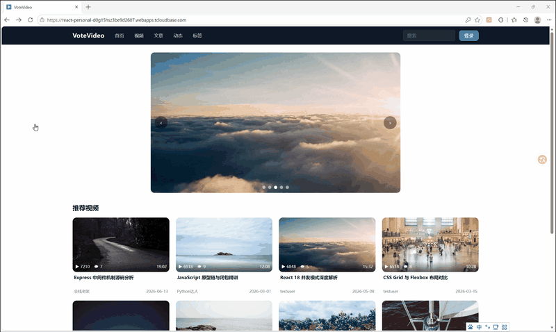

# VoteVideo - 综合内容分享平台

<div align="center">

**一个支持视频、文章、动态等内容展示与分享的现代 Web 应用**

</div>

---

## 项目介绍

VoteVideo 是一个综合内容分享平台，支持视频、文章、动态三种内容形式的展示与互动。项目采用前后端分离架构，前端使用 React 19 构建 SPA 应用，后端基于 Node.js + Express 5 + Prisma 提供 RESTful API 服务。

核心功能包括：多元内容展示与信息卡片列表、搜索与多维排序、用户注册/登录/关注体系、点赞/收藏/评论/转发/历史记录等完整互动链路、基于 SSE 的实时私信通讯、内容上传与标签分类、以及点赞评论关注等实时通知系统。

---

## 项目预览：

- 前端：腾讯云 CloudBase 静态网页托管。（[项目地址](https://react-personal-d0g15hsz3be9d2607.webapps.tcloudbase.com/)）
- 后端：腾讯云 CloudBase 云托管，长时间未访问后服务实例可能处于休眠状态，触发自动启动需要一点时间。

### 功能演示

**媒体浏览** — 轮播图、媒体列表（含骨架屏加载）、媒体页、关联推荐



**用户交互** — 注册，点赞、收藏、评论，查看个人记录，未登录触发全局登录弹窗


---

## 技术栈

### 前端

| 技术 | 用途 |
|------|------|
| React 19 | UI 框架 |
| Vite 6 | 构建工具 |
| React Router DOM 7 | 路由管理 |
| TailwindCSS 4 | 样式框架 |
| Zustand 5 | 状态管理 |
| Axios | HTTP 请求 |
| date-fns | 日期格式化 |
| js-cookie | Cookie 管理 |
| Mock.js | 开发阶段数据模拟 |

> 注：`antd` 仍在 `package.json` 中但已无实际引用，项目 UI 层已完全迁移至 Tailwind CSS。

### 后端

| 技术 | 用途 |
|------|------|
| Node.js 20+ | 运行环境 |
| Express 5 | Web 框架 |
| Prisma 6 | ORM |
| SQLite | 数据库 |
| JWT (jsonwebtoken) | 身份认证 |
| bcrypt | 密码加密 |
| Multer | 文件上传 |
| cors | 跨域处理 |
| dotenv | 环境变量管理 |
| @faker-js/faker | 种子数据生成 |

---

## 项目结构

```
VoteVideo/
├── React/                              # 前端项目
│   ├── src/
│   │   ├── apis/                      # API 请求封装
│   │   │   ├── content.js            #   内容获取 + 统一交互入口 (interact)
│   │   │   └── account.js            #   账户相关 (登录/注册/Profile)
│   │   ├── components/
│   │   │   ├── common/               # 通用组件
│   │   │   │   ├── DataCard/         #   卡片组件 (VideoCard / EssayCard / PostCard / TagCard / UserCard / CommentCard)
│   │   │   │   ├── TopMenu.jsx       #   顶部导航栏
│   │   │   │   ├── DataList.jsx      #   通用数据列表 (含骨架屏/错误态/空态/分页)
│   │   │   │   ├── InteractionBar.jsx#   通用交互操作条 (点赞/收藏/转发/回复)
│   │   │   │   ├── CommentSection.jsx#   评论区组件 (含排序/分页)
│   │   │   │   ├── Chat.jsx          #   私信聊天窗口
│   │   │   │   ├── LoginModal.jsx    #   登录弹窗
│   │   │   │   ├── UserMenu.jsx      #   用户下拉菜单
│   │   │   │   ├── VideoPlayer.jsx   #   视频播放器
│   │   │   │   ├── RelatedSidebar.jsx#   右侧关联内容边栏
│   │   │   │   ├── SortDropdown.jsx  #   排序下拉
│   │   │   │   ├── UploaderCard.jsx  #   上传者信息卡片
│   │   │   │   └── RequireAuth.jsx   #   路由鉴权守卫
│   │   │   └── feature/              # 业务组件
│   │   │       ├── Profile/          #   Profile 子页面
│   │   │       │   ├── ProfileTabContent.jsx  # 上传/收藏/历史 × 视频/文章/动态/评论 (配置驱动)
│   │   │       │   ├── ProfileFollow.jsx     # 关注/粉丝列表
│   │   │       │   └── ProfileMessage.jsx    # 私信/通知列表
│   │   │       └── Upload/           #   上传表单
│   │   │           ├── UploadVideo.jsx
│   │   │           ├── UploadEssay.jsx
│   │   │           └── UploadPost.jsx
│   │   ├── hooks/                    # useData 数据请求 Hook (含竞态保护)
│   │   ├── pages/                    # 页面组件 (Main / Video / Essay / Post / Search / Tag / Upload / Profile / User / Comment / Dynamic 共 11 页)
│   │   ├── router/                   # 路由配置 (createBrowserRouter) + RequireAuth 鉴权
│   │   ├── stores/                   # Zustand 全局状态 (authStore: 登录态/弹窗/用户信息)
│   │   └── utils/                    # Axios 实例与拦截器 (request.js)
│   ├── 记录与想法/
│   │   ├── 记录/                     # 前端各页面实现、组件设计、状态管理等 (13 篇)
│   │   └── 想法/                     # AI 布局探索、CI 体系、状态机等学习笔记 (8 篇)
│   └── package.json
│
├── Node/                              # 后端项目
│   ├── controllers/                  # 控制器层 (10 个: auth/video/essay/post/comment/tag/user/upload/interact/message)
│   ├── middleware/                   # 中间件 (authMiddleware.js: needToken / optionalAuth)
│   ├── routes/                       # 路由定义 (12 个: index + 11 个路由模块)
│   ├── services/                     # 业务逻辑层
│   │   ├── baseService.js           #   工厂函数: 通用 CRUD 生成
│   │   ├── interactionService.js    #   交互状态读取 (批量查询 isLiked/isFavourited 等)
│   │   ├── interactService.js       #   交互动作执行 (toggle 点赞/收藏/转发/点踩/关注)
│   │   ├── messageService.js        #   消息服务 (私信/通知/SSE 推送)
│   │   ├── commentService.js        #   评论服务
│   │   ├── videoService.js          #   视频服务
│   │   ├── essayService.js          #   文章服务
│   │   ├── postService.js           #   动态服务
│   │   ├── tagService.js            #   标签服务
│   │   ├── uploadService.js         #   上传服务
│   │   └── transformers/            #   数据转换层 (纯函数, 5 个: video/essay/post/comment/tag)
│   ├── prisma/                       # 数据模型 (schema.prisma) + 种子数据 (seed.js)
│   ├── utils/                        # 统一响应工具 (sendSuccess / sendList / sendError)
│   ├── 记录/                         # 后端架构演进、分层重构、接口分析等 (23 篇)
│   └── app.js                        # 应用入口
│
├── Dockerfile                         # Docker 部署 (从项目根构建, 端口 80)
├── Node/Dockerfile                    # Docker 部署 (从 Node/ 构建, 端口 3000)
└── README.md
```

---

## 快速开始

### 环境要求

Node.js 20+、npm 10+，SQLite 无需单独安装（Prisma 内置支持）。

### 安装与运行

```bash
# 1. 克隆项目
git clone https://github.com/2772780896/VoteVideo.git
cd VoteVideo

# 2. 安装前端依赖
cd React && npm install

# 3. 安装后端依赖
cd ../Node && npm install

# 4. 配置环境变量（在 Node/ 目录下创建 .env）
# DATABASE_URL="file:./votevideo.db"
# JWT_SECRET="your-secret-key"
# PORT=3000

# 5. 初始化数据库
npx prisma generate
npx prisma db push
npm run seed    # 填充种子数据

# 6. 启动后端（Node/ 目录）
node app.js     # http://localhost:3000

# 7. 启动前端（React/ 目录，新开终端）
npm run dev     # http://localhost:5173
```

> 前端开发服务器已配置 Vite proxy，`/api` 请求自动转发到 `http://localhost:3000`，无需手动处理跨域。

---

## 架构亮点

### 前端

**统一数据管道与 useData Hook**

所有页面遵循 `API 请求 → Axios 拦截器 → useData Hook → 页面组件` 的统一数据流。核心 Hook `useData` 经历多轮迭代形成当前形态：建立 `data/loading/error` 三态模型；提供 `refresh()` 手动重试（无需刷新页面）；通过 `JSON.stringify(params)` 做 depsKey 值比较，解决数组引用不等导致的无限重渲染；使用 `useRef` requestId 自增计数器丢弃竞态过期响应。

**通用交互系统**

点赞、收藏、转发、回复等所有社交动作收敛至一个 `interact(mediaType, action, mediaId)` 函数，通过 `ACTION_MAP` 配置表将 (资源类型, 动作) 映射到对应的 HTTP 方法和路径。新增资源类型或动作只需添加一行配置，替代了原先十多个独立包装函数。

`InteractionBar` 组件内置 `ID_KEY_MAP` 适配不同资源的 ID 字段名（video→vid、essay→eid 等），配合 Zustand 全局登录检查实现"未登录触发全局登录弹窗"的统一体验。交互模式采用"等待成功"策略：先调 API，成功后再更新 UI，逻辑直观无回滚代码。

**Tailwind CSS 驱动 UI**

项目 UI 层已完全使用 Tailwind CSS 实现。TopMenu 由 antd Menu 重构为纯 Tailwind（83 行）；LoginModal 使用 `fixed` 定位覆盖层；Upload 页面用 `<label>` + `<input type="file" hidden>` 实现文件选择；所有 Tabs、Segmented、Avatar、Row/Col 等布局均用 Tailwind flex/grid 工具类重写。迁移过程中删除了十余个冗余包装组件（UploadText、SearchInput、UserVideoFlex、ProfileUpload 等）。

**配置驱动的多类型渲染**

`ProfileTabContent` 通过 `DATA_MAP` 配置表 `{ label, Card, idKey, propName }` 结合 `Object.entries` 遍历，单个组件处理上传/收藏/历史 × 视频/文章/动态/评论共 12 种组合；Search 页面用类似配置表驱动 Tab 切换。Post 详情页采用"Slots 模式"——文本区、图片列表区、视频列表区三个内容槽位独立按数据存在性渲染（`{post.text && <...>}`），天然支持复合类型（文字+图片+视频共存）。

**其他关键设计**

`DataList` 骨架屏使用 `Array(pageSize).fill(0)` 确保占位数量与真实数据一致以实现 CLS=0；Profile 消息页使用 URL 参数承载语义信息（`?tab=message`，可书签化）配合 Router state 传递结构化数据（targetUser，不可见），兼顾可寻址性与安全性。

### 后端

**三层架构**

后端经历多阶段渐进式分层，最终形成 `Routes → Controllers（HTTP 层）→ Services（业务编排）→ baseService（通用 CRUD）→ Transformers（纯函数转换）→ Prisma（数据库）` 的清晰分层。Controller 负责参数提取与响应格式化，Service 负责业务逻辑编排，Transformer 负责数据格式转换。

**baseService 工厂函数模式**

`createService(modelName, config)` 基于闭包实现工厂函数，接收 Prisma 模型名 + 配置项（idField、searchField、defaultSortField、includeConfig、transformFunction、mediaType），返回完整 CRUD 套件：`getListData`、`getItemData`、`count`、`create`、`update`、`delete`。五个资源模块（video/essay/post/comment/tag）共享同一套基础实现，新增资源类型只需一行配置调用。

**Transformer 纯函数层**

数据转换抽取为独立的 `services/transformers/` 目录，五个 Transformer（video/essay/post/comment/tag）均为纯函数——输入 Prisma 原始数据，输出前端友好格式，无数据库访问，无副作用，可独立测试和复用。comment Transformer 支持递归子评论转换。

**交互状态读写分离**

`interactionService`（读）负责批量查询交互状态（isLiked/isFavourited/isReshared/isDisliked），使用 Set 实现 O(1) 查找，由 baseService.getListData 自动调用合并到响应中。`interactService`（写）执行交互动作（toggle like/favourite/reshare/dislike/follow、记录历史、创建回复），两者共享统一的 `INTERACTION_CONFIG` 配置表。

由于 UserLike/UserFavourite/UserReshare 等表采用 `(uid, type, item_id)` 多态关联，无法通过 Prisma 关系进行 join，需要独立批量查询后手动合并——这是有意识的架构取舍。

**配置映射替代 if-else 链**

interactService 通过 `RESOURCE_CONFIG` + `INTERACTION_CONFIG` 查表驱动的通用 `toggleLike`/`toggleFavourite`/`toggleReshare`/`toggleDislike` 函数，替代原先每种资源类型各一套 if-else 分支。新增资源类型从改代码变为加配置。

**optionalAuth 双模认证**

内容路由使用 `optionalAuth` 中间件：解码 JWT 设置 `req.user` 但不阻断匿名请求。匿名访客获取内容但无交互状态，登录用户获取个性化的 isLiked/isFavourited 等状态。前端 Axios 拦截器始终携带 token，后端 optionalAuth 确保内容请求也能识别登录用户。

**SSE 实时消息**

选择 Server-Sent Events 而非 WebSocket：基于 HTTP 协议无需额外端口、防火墙友好。后端通过 Map 管理在线用户（uid → SSE response 对象），30 秒心跳保活，连接关闭自动清理。客户端到服务端使用标准 POST 请求发送消息，服务端到客户端通过 SSE 单向推送。前端 Chat 组件渲染对话气泡（左右对齐区分收发），新消息到达自动滚动到底部。

---

## 数据库设计

项目使用 Prisma ORM + SQLite，包含 16 个数据模型：

| 模型 | 说明 | 模型 | 说明 |
|------|------|------|------|
| `User` | 用户 | `UserFavourite` | 收藏 |
| `Video` | 视频 | `UserLike` | 点赞 |
| `Essay` | 文章 | `UserHistory` | 历史记录 |
| `Post` | 动态 | `UserReshare` | 转发 |
| `Tag` / `VideoTag` | 标签与关联 | `UserDislike` | 踩 |
| `Comment` | 评论（多级回复） | `UserFollowing` | 关注 |
| `Dialogue` | 对话 | `Message` | 消息 |
| `Notification` | 通知 | | |

交互相关表（UserLike/UserFavourite/UserReshare/UserDislike/UserHistory）采用 `(uid, type, item_id)` 多态设计，支持跨视频/文章/动态/评论/标签等多种资源类型的统一交互记录。

---

## 未来方向

### AI 驱动的 UI 定制

探索基于 AI 的运行时样式定制方案。短期路线通过 UserScript 实现：用户选取 DOM 元素 → 将 outerHTML + 自然语言需求发送给 AI → 生成纯 CSS（`!important` 覆盖）→ 动态注入 `<style>` 标签，配合 LocalStorage 缓存和 `@run-at document-start` 防止 FOUC。长期愿景采用混合云边架构：本地小模型（Phi-3 / Transformers.js + WebGPU）做语义意图识别（零延迟），云端大模型返回 Tailwind JSON 布局指令，前端通过 ComponentMapper 字典热更新 UI——无需重新编译，JSON 协议驱动组件动态渲染。

### CI/CD 流水线体系

规划七阶段渐进式 CI 流水线：Format + Lint（Prettier + ESLint）→ Type Check（tsc --noEmit）→ Build → Unit Tests（Vitest）→ Visual Tests（Storybook + Chromatic）→ E2E Tests（Playwright）→ Deploy。前序阶段更快更轻，后序阶段更接近用户视角，任一阶段失败则后续阶段不执行。个人项目推荐优先级：ESLint + Prettier（零成本）> Vitest 单元测试（最高 ROI）> Storybook（组件量增长后）> Playwright E2E（项目稳定后仅覆盖 1-3 核心路径）。

### Storybook 组件可视化开发

Storybook 定位为视觉开发工具和测试前置环节（"看起来对不对"），而非测试框架本身。当前痛点：页面组件将渲染逻辑嵌入 Hook 调用、不接受外部 props，需要后续通过 Container + View 分离或 MSW 插件 mock 解决。计划从通用组件起步，形成可视化组件文档。

### TypeScript 渐进式迁移

计划在未来引入 TypeScript 以增强类型安全和开发体验（自动补全、编译期校验、CI 类型检查、Storybook Controls 自动生成）。迁移策略为渐进式：先在新模块中使用 `.ts/.tsx`，逐步迁移核心工具层（useData Hook、API 封装、Transformer），最终覆盖全量代码。当前优先级排在 CI 流水线和 Storybook 完善之后。

---

## 开发记录

项目开发过程中的架构决策、问题排查和技术复盘，以文档形式存放在项目目录下：

| 目录 | 内容 | 篇数 |
|------|------|------|
| `React/记录与想法/记录/` | 前端各页面实现、useData 演进、组件设计、状态管理迁移 | 13 篇 |
| `React/记录与想法/想法/` | AI 布局探索、CI 体系、Storybook、状态机等学习笔记 | 8 篇 |
| `Node/记录/` | 后端架构演进、分层重构、前后端对齐、Service/Transformer 设计 | 23 篇 |

---

## 开源协议

本项目为个人学习实战项目，仅供学习交流使用。